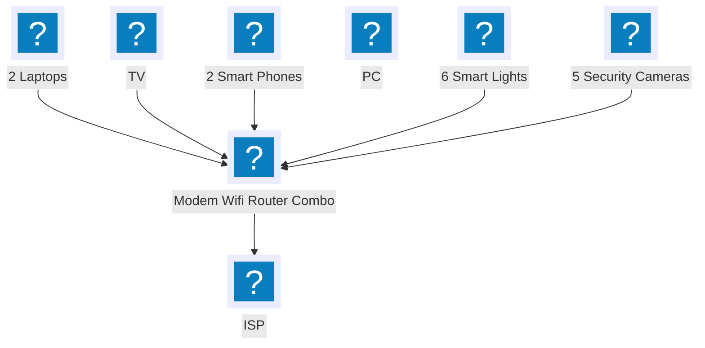

Last time I checked the clock, it was 11:00am and right now I have no idea because I'm in the [flow state](https://en.wikipedia.org/wiki/Flow_(psychology)).
The bug had no chance.
I'm now wrapping up the report in my pull request.
An Outlook popup breaks through my concentration, reminding me of a meeting in 5 minutes!!!
I hop onto teams but it's not connecting.
Oh no!
This is the worst time to lose my connection.
I have no time to debug, not even enough time to restart my modem.
That'll have to wait for another time.
I turn on my mobile hotspot and connect to that.
I make it late to my meeting, but the meeting hasn't started yet because I'm not last to arrive.
I let out a huge sigh of relief.
During the entire meeting, something is nagging away at me preventing me from focusing on my meeting.
My phone's internet through wifi looked ok before I had to disconnect for the mobile hotspot.

# First Clue

With my meeting, over I try to recover the internet on my laptop.
First thing I notice is as I switch off my mobile hotspot, my phone has internet through wifi but my laptop still does not.
That's fishy.
It's likely an issue with my laptop.
I do the normal troubleshooting steps:
1. reset computer
2. reset modem
3. on laptop forget wifi
4. on modem, forget laptop

It wasn't until step 4 that my laptop regained internet.
I was confused, but relieved that I could get back to work.

30 minutes later, and my internet connection was out again.
I didn't have time to keep messing with my wifi,
so I hopped back on my mobile hotspot to avoid anymore interruptions and get back into the flow.
Fortunately, I didn't have any meetings for the rest of the day so I was able to merge the bugfix.

# Joseph Mate (a note to the reader)

Some readers at this point might already know what the issue is just from the facts above and wondering why I'm even writing about it.
My only background in networking is a networking course 14 years ago.
I've never done desk support, and all of my debugging has been in software stack.
The closest I got to diagnosing these kinds of issues was a lab from that course 14 years ago, where we setup LAN routing and a DHCP server.
So this article is for those software developers that haven't peered below the software stack
and also to share how excited I was to solve it myself!

# Second Clue

With the day over, and nothing on my plate, it was time to get serious.
What was going on?
Only my laptop had the issue.
The wifi modem had to forget my laptop before I could reconnect.
Just before forgetting the modem on my laptop, I noticed something strange.
My laptop's local IP address was 192.168.0.3!
Because I always go to 192.168.2.1 to reset my modem, I knew that my IP address should have been in the 192.168.2.0/24 subnet.
How did I get this unexpected IP address?

# DCHP

I googled for various permutations of the fact above, I stumbled upon this stackoverflow article: [Why is the IP address in network (MacBook setting) is different than the IP in the router's config page?](https://superuser.com/questions/1858131/why-is-the-ip-address-in-network-macbook-setting-is-different-than-the-ip-in-t/1858168)

[The top answer](https://superuser.com/a/1858168/293310) says to assign a static IP to fix the issue but does not explain how or why the laptop was given a new IP address.

The comments provided more valuable theories:

> [Your MacBook and your phone are not connected to the same network.](https://superuser.com/questions/1858131/why-is-the-ip-address-in-network-macbook-setting-is-different-than-the-ip-in-t#comment2947034_1858131)

This is one level deeper and explains why internet connectivity was lost but not why we were given an new IP address.

> [You probably have two devices acting as NAT gateways and DHCP servers on your network. ](https://superuser.com/questions/1858131/why-is-the-ip-address-in-network-macbook-setting-is-different-than-the-ip-in-t#comment2947091_1858131)

When a device connects to a local network, by default it broadcasts a message asking for an IP address. 
This was what I initially thought too and quickly rejected because I'm not running a second DHCP server.
This comment made me reconcider the second DHCP theory
so I enumerated all the devices on my network to double check:



I connect to the Internet through a modem provided by the ISP that also has a wifi router in it.
All my devices talk through wifi on either 2.4 or 5 GHz.
None of the devices should be running a DHCP server.
We had a ghost in the wifi!
The DHCP server wasn't the root cause.

# Wireshark

So I installed [Wireshark](https://www.wireshark.org/) and starting recording everything I was receiving from the network. Half an hour later I got:

```
56711   1106.460911 0.0.0.0 255.255.255.255 DHCP    342 DHCP Discover - Transaction ID 0xa94a124d
56713   1106.472187 192.168.2.1 192.168.2.26    DHCP    342 DHCP Offer    - Transaction ID 0xa94a124d
56715   1106.550081 192.168.0.1 255.255.255.255 DHCP    342 DHCP Offer    - Transaction ID 0xa94a124d
```

For some reason there is a DHCP Discover and **TWO** things respond back. Where did 192.168.0.1 come from?

The message from 192.168.2.1 is (note: I changed all the MAC addresses because I did not feel comfortable giving mine away):
```
Ethernet II, Src: SagemcomBroa_00:00:00 (80:20:da:00:00:00), Dst: Apple_00:00:00 (84:38:35:00:00:00)
```

The src is the mac address of my modem which I confirmed by logging into the management UI and finding 80:20:DA:00:00:00 as the WAN Mac address.

The message from 192.168.0.1 is:
```
Ethernet II, Src: AltoBeam_00:00:00 (38:be:ab:00:00:00), Dst: Broadcast (ff:ff:ff:ff:ff:ff)
```
I have no idea what AltoBeam_00:00:00 is! Not only that, it's not specifically sending it to me (Apple_00:00:00), it's broadcasting it.


I have given up on finding AltoBeam_00:00:00. I suspect it's my broken security camera that lost connection to the network. For now to workaround this I set the IP manually so I can keep debugging with a stable internet connection.

System Settings -> Wifi -> Details - TCP/IP:
```
    Configure IPv4: Manually
    IP address: 192.168.2.26 (this is the one the router was reporting)
    Subnet mask: 255.255.255.0
    Router: 192.168.2.1 (this is the one my wifi router uses)
```

Later, I consulted the Smart Home management app on my phone and it says that AltoBeam_00:00:00 is my outdoor security camera!
This is one of the cameras that is working though!
It's not the broken one.
I'm able to view the live feed without issue.
It should not be running a DHCP server
and I'm not sure how stop it other than throw the camera out.

Now that I know the root cause, I can see multiple people reporting it:
* [Some Device doesn’t Receive Default Gateway](https://forum.openwrt.org/t/some-device-doesnt-receive-default-gateway/184084/4)
* [Problem: Xiaomi AW300 cam disconnects Wi-Fi](https://www.reddit.com/r/SecurityCamera/comments/1729s6v/problem_xiaomi_aw300_cam_disconnects_wifi/)
* [Multiple Xiaomi Smart cameras causing laptop and Mobile phone to disconnect from Wifi router](https://www.reddit.com/r/Network/comments/18is4f6/multiple_xiaomi_smart_cameras_causing_laptop_and/)

# Solution

Unfortunately, I cannot simply stop using the security camera.
I spent so much time mounting it and wiring it, so I was way too lazy to buy and install another one.
So I followed the advice from the [top answer in the stack overflow thread](https://superuser.com/a/1858168/293310) and continued to assign a static IP to my laptop.
The static IP workaround became a permanant fix.
The problem never came back for my laptop.

# Why does my security camera run a DHCP server?

One of the approaches smart devices like this security camera, smart lights and others use is to ask you to connect to their temporary wifi network in order for you to send your wifi password to the device.
Some examples:
* [Kasa smart plugin install guide](https://www.tp-link.com/us/support/faq/946/)
* [TP Link camera](https://www.tp-link.com/us/support/faq/2710/) 

Unfortunately for me, the DHCP server was running outside of this device setup window.

As an example, from [Xiaomi Mi 360° 1080p Full HD WiFi Smart Security Camera Recovery Image](https://github.com/paramaggarwal/mi-camera),
if you extract it using [7-Zip](https://www.7-zip.org/),
you will find a [legacy SysVinit](https://www.linuxjournal.com/content/embracing-future-transition-sysvinit-systemd-linux) script located at `/etc/init.d/S41wifi` 

```bash
#!/bin/sh
#
# Start the wifi...
#

case "$1" in
  start)

        echo "Starting wifi ......"
        /mnt/data/bin/wifi_start.sh &
                ;;
  stop)
        printf "Stopping wifi..."
        /usr/bin/killall wpa_supplicant hostapd dhcpd
        /sbin/ifconfig wlan0 down
        /sbin/modprobe -r mt7601Usta.ko
        ;;
  restart|reload)
        "$0" stop
        "$0" start
        ;;
  *)
        echo "Usage: $0 {start|stop|restart}"
        exit 1
esac

exit $?
```

The link provided seems like an incomplete copy of the firmware because
I do not have access to `/mnt/data/bin/wifi_start.sh`.
I suspect that's where the [dhcpd](https://man.openbsd.org/dhcpd.8) is started.

# Open Questions

I'm glad to have a stable internet connection again,
but I'm only partially statisfied with the outcome because these answers just bring more questions than what I started with.
It also leaves me with a humble understanding of the limitation of my skills in networking and hardware.

1. Why didn't any of my other devices like my phone fall victim to the double DHCP server? Is it limited to some OSes?
2. Shouldn't my laptop have had a stickier commitment to the DHCP server it was already using if it was still working?
3. Why does my security camera run a DHCP server outside of the setup process? A bug? I wish I could see that particular device's source code.
